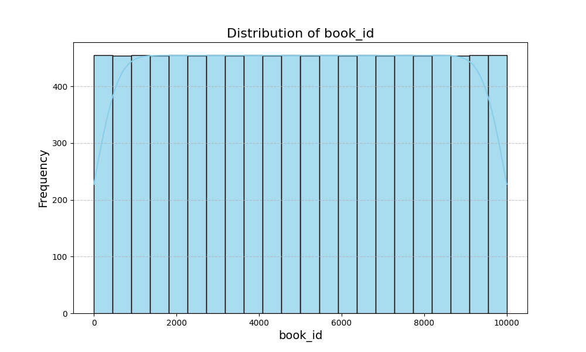
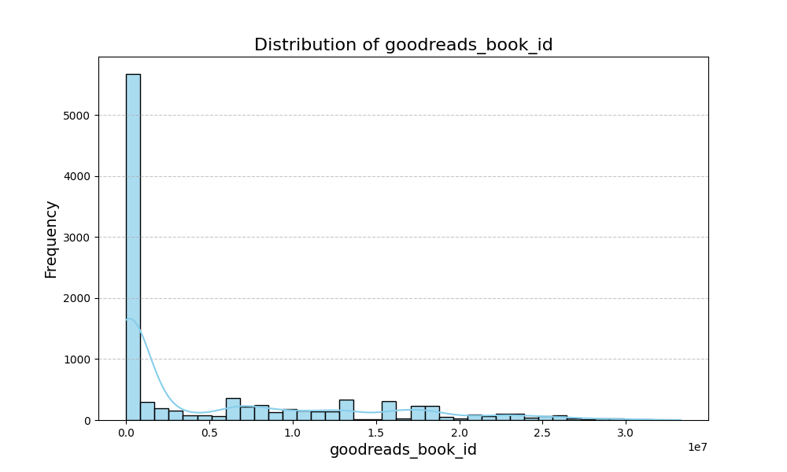
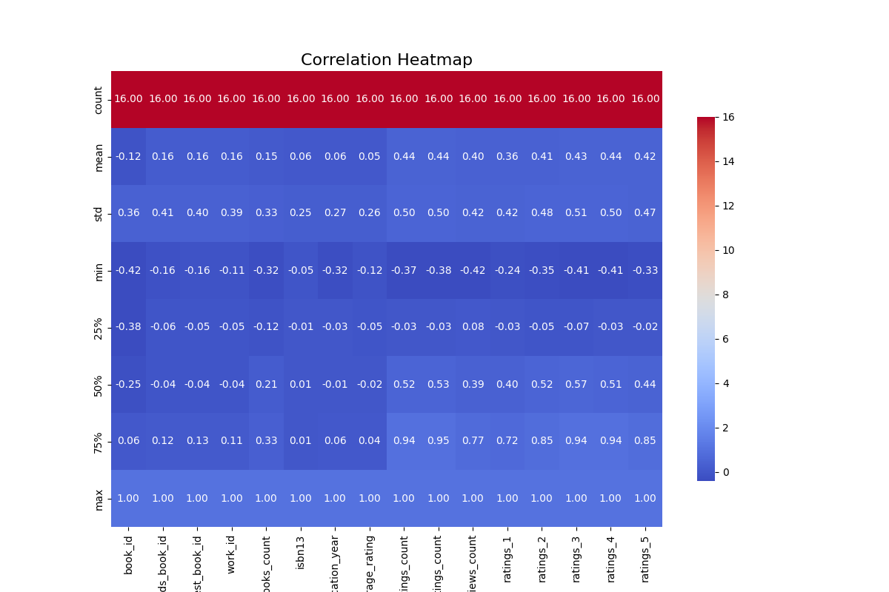

# Automated Data Analysis Report

## Dataset Description
- **Rows:** 10000
- **Columns:** 23
- **Missing Values:** {'book_id': 0, 'goodreads_book_id': 0, 'best_book_id': 0, 'work_id': 0, 'books_count': 0, 'isbn': 700, 'isbn13': 585, 'authors': 0, 'original_publication_year': 21, 'original_title': 585, 'title': 0, 'language_code': 1084, 'average_rating': 0, 'ratings_count': 0, 'work_ratings_count': 0, 'work_text_reviews_count': 0, 'ratings_1': 0, 'ratings_2': 0, 'ratings_3': 0, 'ratings_4': 0, 'ratings_5': 0, 'image_url': 0, 'small_image_url': 0}

## Narrative Analysis
The dataset contains 10,000 book entries with 23 columns, revealing significant characteristics and relationships among various book attributes. A key takeaway is the presence of substantial missing values across several critical columns, notably ISBN codes, authors, original publication years, and ratings. While categorical fields like `book_id` and `goodreads_book_id` are fully populated, fields crucial for understanding book quality and popularity, such as `average_rating` and `ratings_count`, have many zero entries, which likely reflects a lack of reviews for numerous books.

### Key Insights:
1. **Missing Data**: Columns like `isbn` (700 missing), `isbn13` (585 missing), and others associated with ratings indicate a potential barrier to performing robust analysis on book quality and popularity. The high count of missing values should prompt a careful strategy for data imputation or exclusion, especially before conducting predictive modeling.

2. **Distribution of Book Attributes**: The mean book count (`books_count`) stands at 75.7 with a high standard deviation (170.5), suggesting a small number of books have an extremely high count. A closer look may reveal outliers that could skew analysis.

3. **Correlations**:
   - The average ratings (`average_rating`), which has several zeroes, show a weak positive correlation with `ratings_count` (0.437), indicating that as ratings increase, counts of those ratings might also rise. This means refining the dataset to focus on books with non-zero ratings will be crucial for more reliable analysis.
   - The correlation between `work_ratings_count` and `work_text_reviews_count` also indicates a strong positive relationship (0.442), highlighting the potential for user engagement metrics to inform about a book's popularity.
   - The weak correlations among most other columns suggest they are not strongly interlinked; thus, predicting one attribute based on another might not be effective without further adjustments.

### Actionable Recommendations:
- **Data Cleaning**: Focus on addressing the missing values through imputation or exclusion based on analysis goals—particularly those affecting `average_rating`, `ratings_count`, and `authors`.
  
- **Feature Engineering**: Create new features from existing ones to capture underlying patterns that may enhance model performance. For instance, categorizing books by publication year might help.

- **Concentrate on High-Quality Data**: For any predictive analysis, filter out entries with zero ratings and missing authors, as they compromise the quality of insights generated.

This dataset presents opportunities to derive insights into book attributes and user preferences once the issues of missing data are resolved. Further analysis, particularly on books with complete data, could better inform trends in book ratings and user engagement.

## Visualizations

