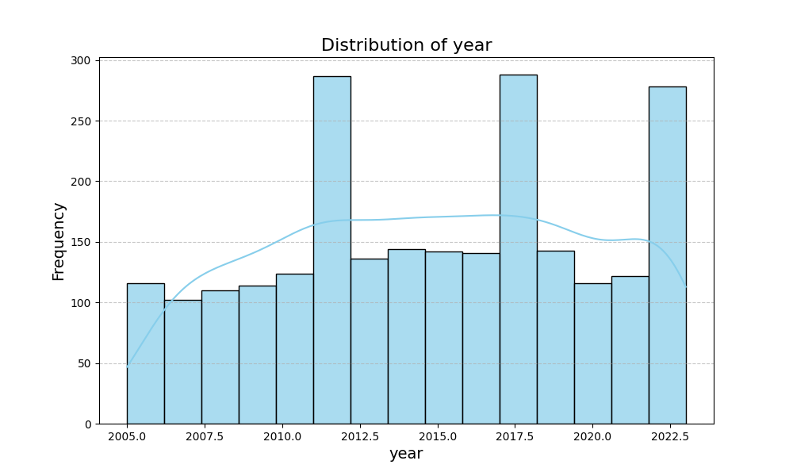
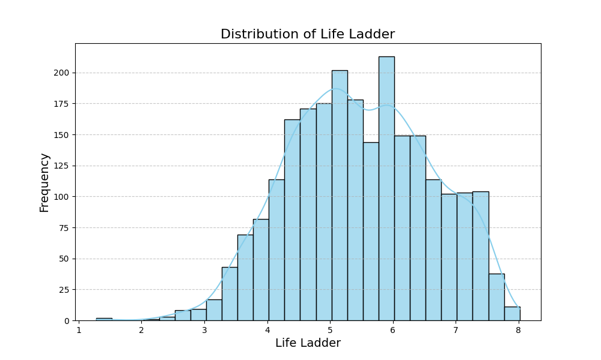
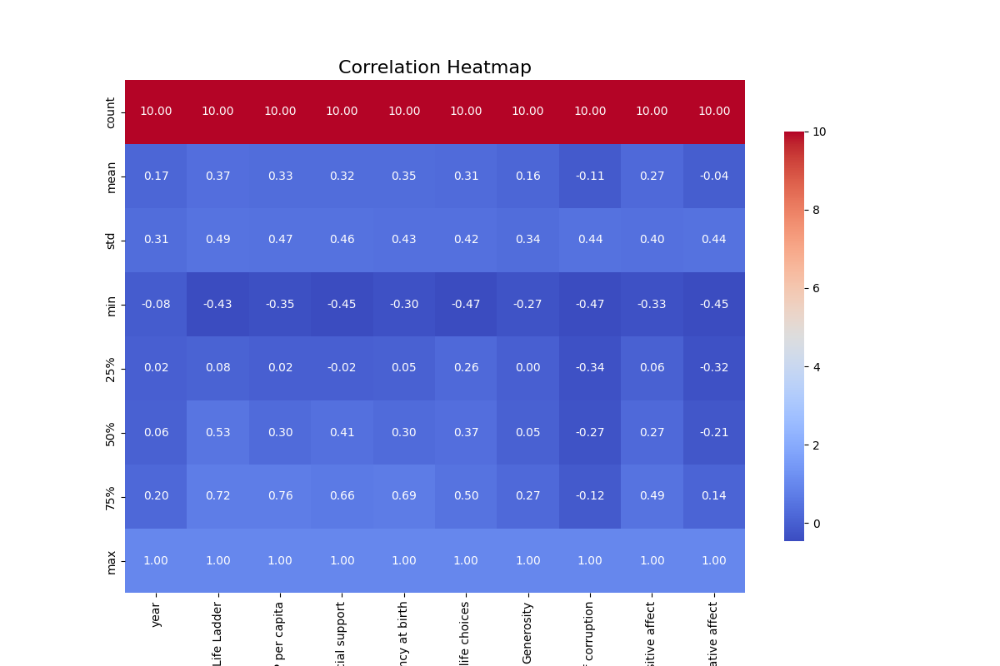

# Automated Data Analysis Report

## Dataset Description
- **Rows:** 2363
- **Columns:** 11
- **Missing Values:** {'Country name': 0, 'year': 0, 'Life Ladder': 0, 'Log GDP per capita': 28, 'Social support': 13, 'Healthy life expectancy at birth': 63, 'Freedom to make life choices': 36, 'Generosity': 81, 'Perceptions of corruption': 125, 'Positive affect': 24, 'Negative affect': 16}

## Narrative Analysis
The dataset comprises 2,363 rows and 11 columns, reflecting various indicators of well-being and economic conditions across countries from 2005 to 2023. Notably, several columns contain missing values, particularly in the metrics related to social and psychological well-being, such as Generosity (81 missing) and Perceptions of corruption (125 missing), which may affect the overall analysis of these dimensions.

### Key Findings:
1. **Temporal Coverage**: The data spans years with an average year of 2014.8, indicating a focus primarily in recent times while also including earlier years back to 2005. This could imply changing trends in well-being as countries evolve economically and socially.

2. **Life Ladder Score**: The average Life Ladder score is 5.48, with a notable standard deviation (1.13) suggesting diverse perceptions of well-being across countries. The minimum score (1.28) indicates severe dissatisfaction in some regions, while the maximum (8.02) reflects high satisfaction levels elsewhere.

3. **Economic Indicators**: The average Log GDP per capita is 9.40 (approx. $12,250), with a wide range from 5.53 to 11.68, showing significant economic disparities globally. Countries at lower GDP per capita are likely to experience lower life satisfaction as reflected in the Life Ladder scores.

4. **Social Support**: The mean social support score is relatively high at 0.81; however, its standard deviation indicates variability. This suggests that while some countries provide strong community support, others may lack in this critical area, impacting overall life satisfaction and stability.

5. **Correlations**: There is a positive correlation between Life Ladder scores and Log GDP per capita (0.37) and Social support (0.37), indicating that higher economic wealth and community support are associated with improved subjective well-being. However, the correlation with Generosity is weak and negative (-0.11), suggesting that economic conditions do not strongly influence perceptions of generosity across countries.

6. **Healthy Life Expectancy**: There is a noted gap in the data for Healthy life expectancy at birth, with 63 missing values, which could obscure insights into health's impact on life quality. Including this metric is essential for a holistic understanding of well-being.

### Actionable Insights:
- **Data Completeness**: Assess the implications of missing values, especially in areas such as Generosity and Perceptions of corruption, to enhance understanding of socio-economic relationships.

- **Policy Focus**: Countries with low Life Ladder and Log GDP per capita scores should prioritize economic growth strategies alongside community support initiatives to enhance citizen well-being.

- **Further Analysis**: Investigate the drivers behind the diversity in Life Ladder scores, particularly focusing on social support mechanisms across countries, and how these relate to economic performance.

- **Health Metrics**: Encourage the collection of comprehensive health data to complement existing economic and social insights, allowing for a more integrated approach to improving overall life satisfaction.

Overall, the dataset reveals critical relationships among economic conditions, social support, and life satisfaction, underscoring the importance of addressing these factors collectively to promote well-being across nations.

## Visualizations

