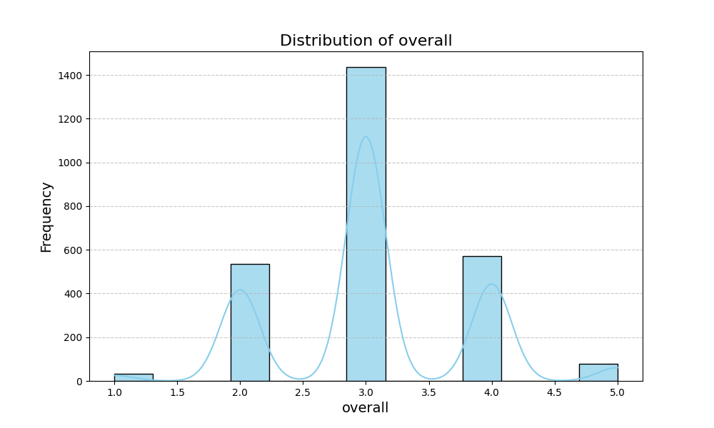
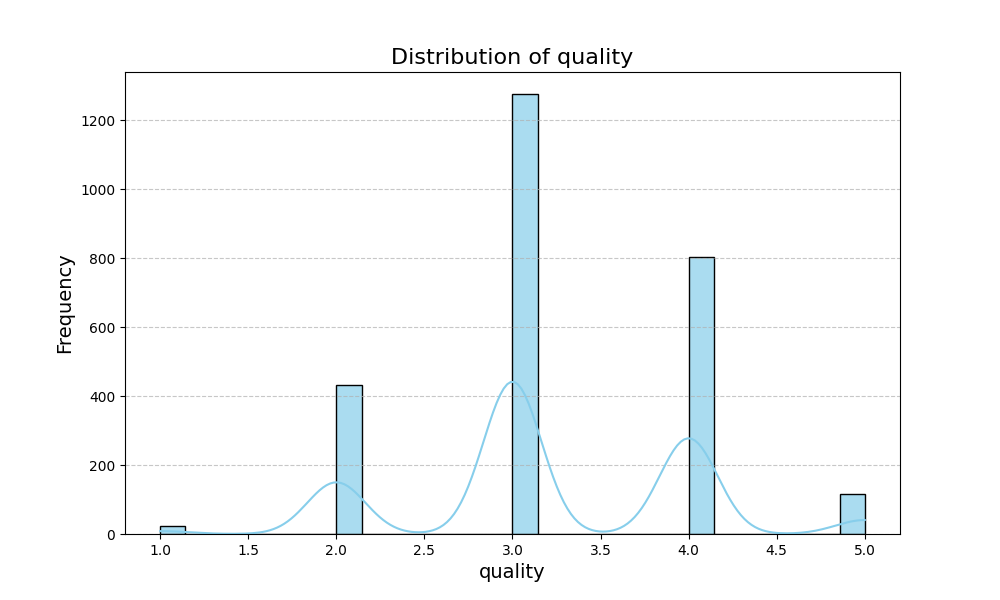
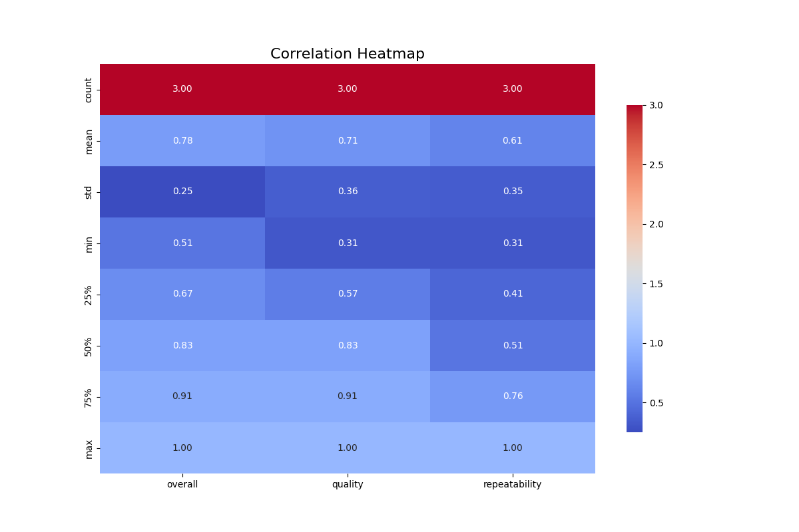

# Automated Data Analysis Report

## Dataset Description
- **Rows:** 2652
- **Columns:** 8
- **Missing Values:** {'date': 99, 'language': 0, 'type': 0, 'title': 0, 'by': 262, 'overall': 0, 'quality': 0, 'repeatability': 0}

## Narrative Analysis
The dataset consists of 2,652 records with 8 attributes. Key observations regarding missing values highlight a significant gap in the 'by' column, with 262 out of 2,652 entries missing this data, representing roughly 10% of the dataset. All other columns, including 'date', 'language', 'type', 'title', 'overall', 'quality', and 'repeatability', report no missing values, implying that the majority of the dataset is intact and usable for analysis, aside from author information.

Statistical summaries suggest that most numerical columns are underrepresented, with no data reported for 'date', 'language', 'type', and 'title'. This indicates either a data collection issue or that these fields are categorical with insufficient data points for meaningful quantitative analysis.

In the available correlation summary, key metrics 'overall', 'quality', and 'repeatability' show a limited sample size (only 3 records) with respective means of approximately 0.78, 0.71, and 0.61. These suggest that, while there are some assessments available, the overall dataset could benefit from more comprehensive data for robust insights.

Trends in the correlations imply a positive relationship among the variables, as all three metrics appear to have reasonable means and standard deviations, suggesting evaluations of 'overall' performance align closely with both 'quality' and 'repeatability.' However, the limited sample size constrains the reliability of these insights.

Actionable insights would include:
1. **Data Enrichment**: Focus efforts on recovering missing 'by' entries to enrich user context and performance analysis.
2. **Increase Dataset Volume**: Seek to expand the dataset, particularly for 'date', 'language', 'type', and 'title', which could provide broader insights and allow for more detailed trend analysis.
3. **Investigate Relationships**: Explore the underlying factors influencing 'overall', 'quality', and 'repeatability' metrics for more nuanced understandings.

Overall, while the dataset holds potential, its current limitations highlight gaps that, if addressed, could yield deeper, more systematic insights into the data's underlying phenomena.

## Visualizations

